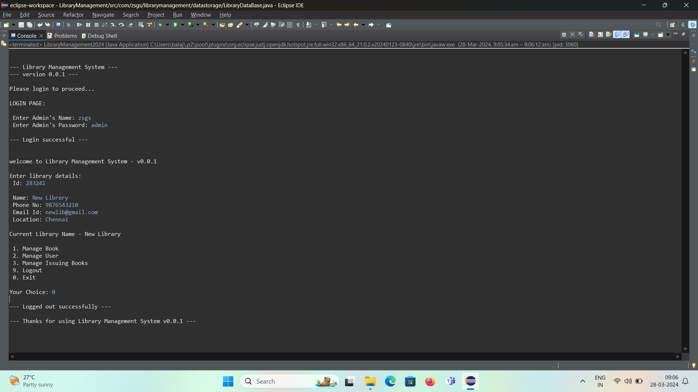
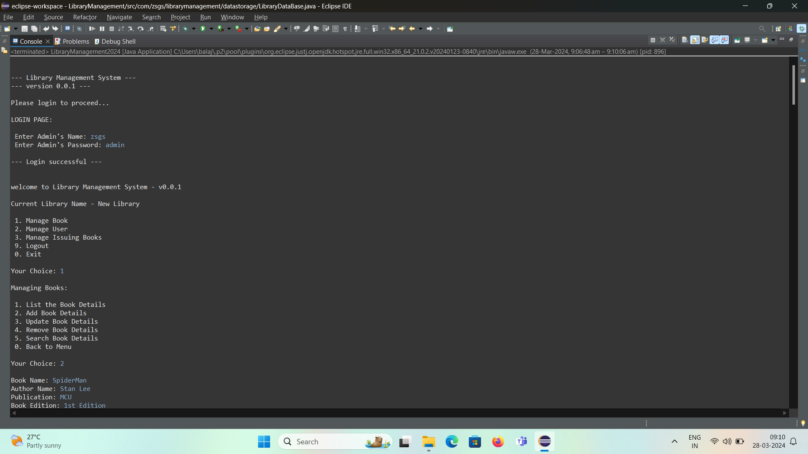
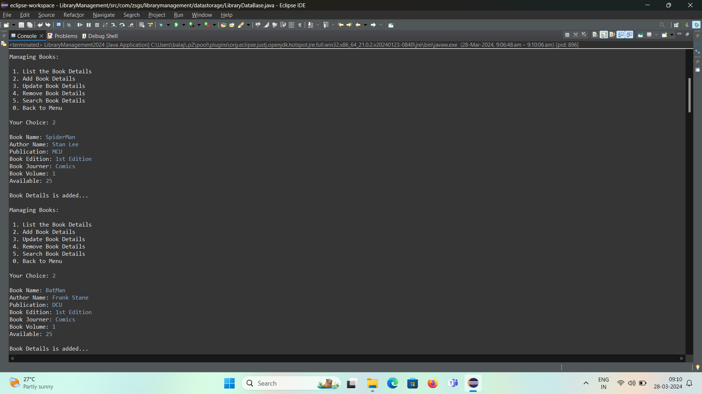
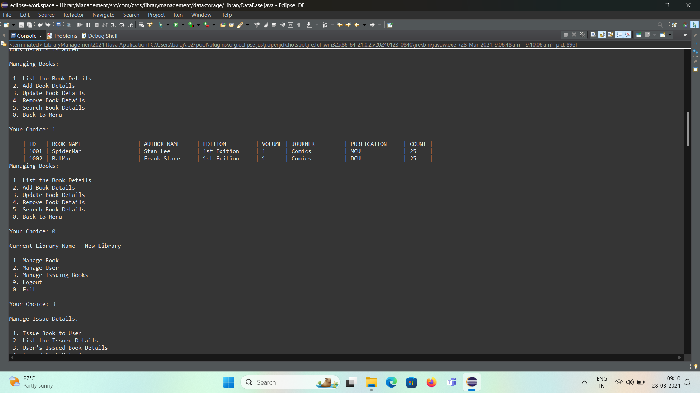
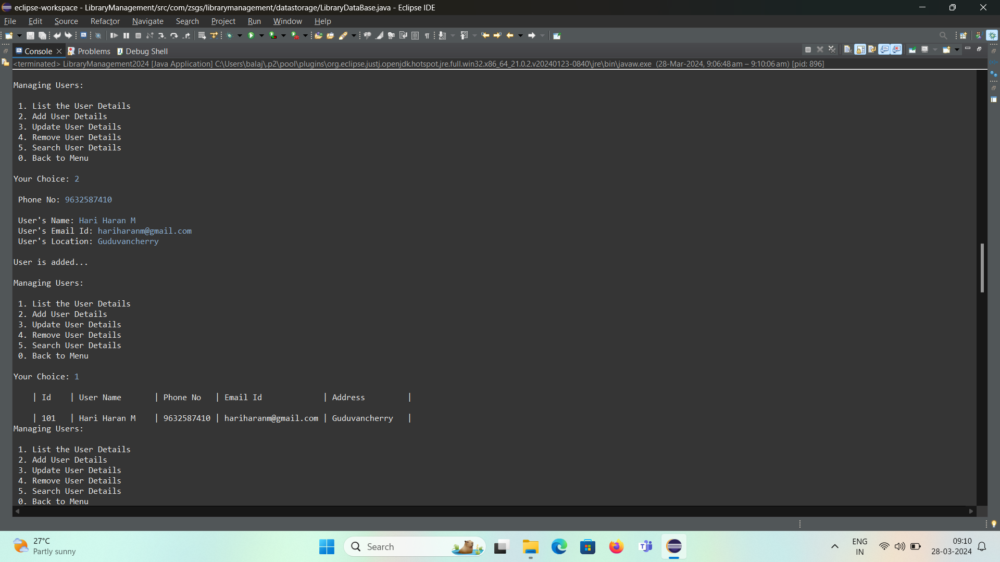
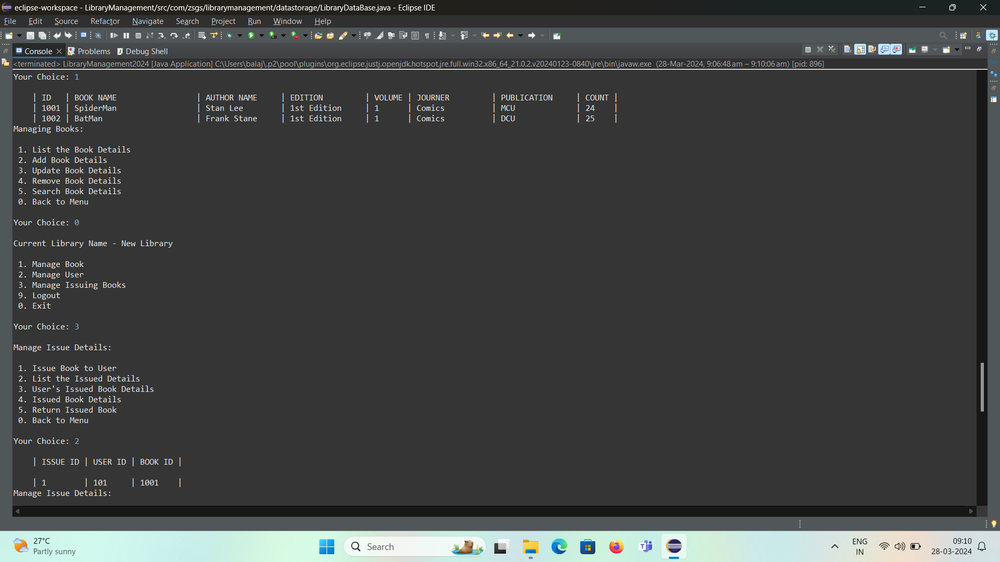
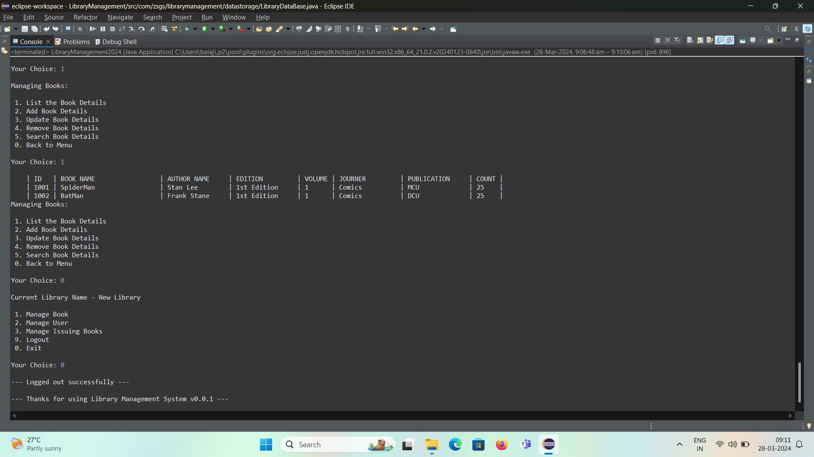

# Library Management Application

This application is designed to streamline the library management by providing features for managing users, books, issued books by admin. 

## Features

- Admin User Login & Logout (session maintenance)
- Setup Library
- Managing Users
- Create Users
- Remove Users
- Update Users
- Search Users
- Managing Books
- Create Books
- Remove Books
- Update Books
- Search Books
- Managing Issued Books
- Issue Books to User
- Return get Books from User
## Developed Using

IDE: Eclipse

Language: Java
## Screenshots

